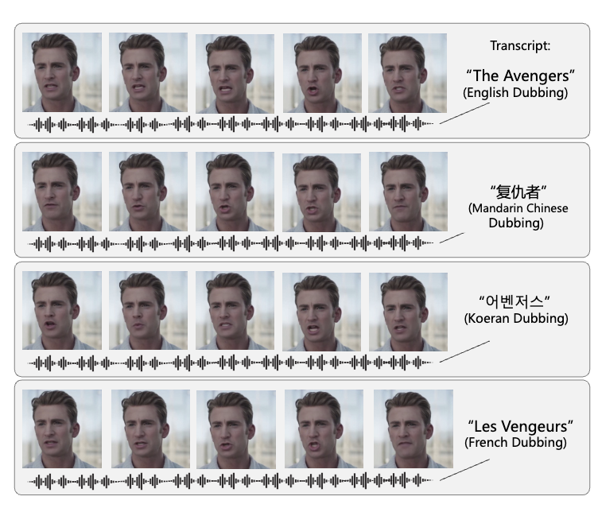
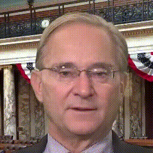

# DiffDub: Person-generic visual dubbing using inpainting renderer with diffusion auto-encoder

<p align="center">
  <a href="https://liutaocode.github.io/DiffDub/">Demo</a> &nbsp;&nbsp;&nbsp; <a href="https://arxiv.org/abs/2311.01811">Paper</a> &nbsp;&nbsp;&nbsp; <a href="https://github.com/liutaocode/DiffDub">Code</a>
</p>

<p align="center">
  
</p>

Scenario: "Mouth Replacement" "Lip Editing", suitable for video translation, live streaming, etc.

## Environment Installation

```shell
conda create -n diffdub python==3.9.0
conda activate diffdub
conda install pytorch==1.8.0 torchvision==0.9.0 torchaudio==0.8.0 cudatoolkit=11.1 -c pytorch -c conda-forge
pip install -r requirements.txt
```

## Model Zoo

Please download the checkpoint from [URL](https://huggingface.co/taocode/diffdub/tree/main/assets) and place them into the following folder.

```
assets/checkpoints/
├── stage1.ckpt 
└── stage2.ckpt 
```

- `stage1.ckpt`: Lip rendering module. This module takes a mask and lip movements as inputs to render a face with specific lip movements. In this repository, this model is also referred to as the renderer, auto-encoder, or diffusion model, all of which are synonymous.
- `stage2.ckpt`: Sequence generation module. This module takes audio and reference lip movements as inputs to generate a lip sequence (also called Motion/Lip Latent). The generated lip sequence is then passed to the previous model for rendering.

<details><summary>Why Two Stages?</summary>
Most lip-sync models use a single-stage approach, while our model adopts a two-stage training strategy. These two stages are trained separately to distinguish between the rendering process and the motion generation process. 

In the first stage, we handle the rendering process, which involves pixel-level generation and consumes a significant amount of computational resources. This increases the model size, and handling multiple frames becomes a challenge. In the second stage, we focus on motion generation, which is a sequential modeling task where longer time spans are theoretically better. However, combining these two processes in a single stage would create conflicts. 

By separating these two stages, we ensure high rendering quality while leveraging the benefits of long-term modeling. These benefits include maintaining temporal stability, reducing the need for paired data, not requiring strictly aligned audio-video data, and generating more comprehensible video content. (By "long-term," we mean generating several seconds at a time rather than 200-300 milliseconds.) 

This two-stage model design not only improves the quality and coherence of the generated videos but also resolves the conflicts between resource consumption and the duration of sequential modeling.
</details>

## Use Case

Input: One video / Image + an audio

Output: A new lip-synced video driven by the audio

**One-shot**

Only one frame from the video is taken as the reference frame (the code here randomly selects a frame from the video) to be used as the input for the reference lip latent in the second stage.

```
python demo.py \
    --one_shot \
    --video_inference \
    --stage1_checkpoint_path 'assets/checkpoints/stage1_state_dict.ckpt' \
    --stage2_checkpoint_path 'assets/checkpoints/stage2_state_dict.ckpt' \
    --saved_path 'assets/samples/RD_Radio30_000/' \
    --hubert_feat_path 'assets/samples/WRA_LamarAlexander_000/WRA_LamarAlexander_000.npy' \
    --wav_path 'assets/samples/WRA_LamarAlexander_000/WRA_LamarAlexander_000.wav' \
    --mp4_original_path 'assets/samples/RD_Radio35_000/RD_Radio35_000.mp4' \
    --denoising_step 20 \
    --saved_name 'one_shot_pred.mp4' \
    --device 'cuda:0'
```

Results:


You view it on [assets/samples_results/one_shot_pred.mp4](assets/samples_results/one_shot_pred.mp4).

**Few-shot**

Take a segment of the video as reference frames (the code here takes the first 3 seconds of the video, totaling 75 frames) to be used as the input for the reference lip latent in the second stage. (More reference frames can provide finer lip details, but may be limited by the training data, resulting in an effect similar to one-shot in this repo)

```
python demo.py \
    --video_inference \
    --stage1_checkpoint_path 'assets/checkpoints/stage1_state_dict.ckpt' \
    --stage2_checkpoint_path 'assets/checkpoints/stage2_state_dict.ckpt' \
    --saved_path 'assets/samples/RD_Radio30_000/' \
    --hubert_feat_path 'assets/samples/WRA_LamarAlexander_000/WRA_LamarAlexander_000.npy' \
    --wav_path 'assets/samples/WRA_LamarAlexander_000/WRA_LamarAlexander_000.wav' \
    --mp4_original_path 'assets/samples/RD_Radio35_000/RD_Radio35_000.mp4' \
    --denoising_step 20 \
    --saved_name 'few_shot_pred.mp4'\
    --device 'cuda:0'
```

Results:


You view it on [assets/samples_results/few_shot_pred.mp4](assets/samples_results/few_shot_pred.mp4).

**One-shot Under Single Portrait**

This script is designed to test the effect of audio driving a single image, specifically for lip movement.

Unlike the scripts mentioned above, you need to disable `video_inference` and modify `reference_image_path` to the image you want to drive. `mp4_original_path` will be ignored in this condition.

```
python demo.py \
    --one_shot \
    --stage1_checkpoint_path 'assets/checkpoints/stage1_state_dict.ckpt' \
    --stage2_checkpoint_path 'assets/checkpoints/stage2_state_dict.ckpt' \
    --saved_path 'assets/samples/RD_Radio30_000/' \
    --hubert_feat_path 'assets/samples/RD_Radio32_000/RD_Radio32_000.npy' \
    --wav_path 'assets/samples/RD_Radio32_000/RD_Radio32_000.wav' \
    --denoising_step 20 \
    --saved_name 'one_shot_portrait_pred.mp4'\
    --device 'cuda:0' \
    --reference_image_path 'assets/single_images/test001.png'
```

Results:



You view it on [assets/samples_results/one_shot_portrait_pred.mp4](assets/samples_results/one_shot_portrait_pred.mp4).


- To extract Hubert features for inference of your own audio, please refer to [this documentation](https://github.com/liutaocode/talking_face_preprocessing?tab=readme-ov-file#audio-feature-extraction) to obtain the Hubert feature. We also provide the pre-extracted features for the audios in `test_demos/audios` at [URL](https://huggingface.co/taocode/diffdub/tree/main/assets/samples) for your testing. 
- The examples provided in this URL are unseen and have not been trained on.
- After downloading from [URL](https://huggingface.co/taocode/diffdub/tree/main/assets/samples), you can run `python demo_with_batch.py` for random batch testing.


## Model Limitations

This model is not a final product. Due to the model being trained only on HDTF, it has the following potential biases. Please pay **special attention** when using it:

- The driving speech is best in English. The model has seen fewer examples of other languages, resulting in inferior performance on other languages.
- HDTF primarily consists of frontal faces. The model excels at handling frontal faces, but significant angles may cause distortion.

## Plans

- Due to limited human resources, this repository only addresses **urgent bugs**. There are currently no plans to update or iterate on other requirements, including further code optimization. We appreciate your understanding.
- There may be bugs or unoptimized areas marked with `TODOs` in the code. Please carefully check these sections for potential risks.
- We welcome all users to contribute via pull requests.

## Suggestions

<details><summary>1. Suggestions on Training the Model.</summary>
We have provided the original training code. Due to differences in training environments and data processing methods, we cannot guarantee that the above code will run quickly on your training device. Our main modification is adding a mask to the [diffae](https://github.com/phizaz/diffae) framework. When training the first stage rendering model, we recommend referring to the training process of this library. (Please note that it is essential to use the ffhq256 pre-trained model from [diffae](https://github.com/phizaz/diffae) as the initialization parameter for training; otherwise, the new model will not converge :) The second stage of training is much easier, involving only an MSE loss. Additionally, we used different versions of Lightning for the first and second stages of training: 1.4.5 for the former (consistent with diffae) and 2.0.6 for the latter.
</details>

<details><summary>2. Suggestions to Speed Up the Model.</summary>
The primary bottleneck is the first stage diffusion model, which is relatively slow. Possible solutions include using faster sampling algorithms to replace DDIM or switching to a GAN-based method (GAN requires careful tuning to achieve comparable results). Currently, generating 10 seconds of audio takes 6 minutes (using a 3090 GPU, with an average GPU utilization of 60%, there is still room for optimization).
</details>

<details><summary>3. Suggestions to Generate Higher Video Resolutions, such as 512.</summary>
Try retraining the first stage with the image size set to 512. After completing this, retrain the second stage. This approach can enhance the resolution.
</details>

<details><summary>4. Suggestions for Future Improvements.</summary>
An intuitive suggestion is to increase the dataset size, for example, by adding multi-view and multi-language datasets, which can enhance the model's generalization ability in different scenarios. Additionally, the face bounding box can be further optimized, as it does not always cover the chin and throat areas well in some conditions.
</details>

## Citation

```
@inproceedings{liu2024diffdub,
  title={DiffDub: Person-Generic Visual Dubbing Using Inpainting Renderer with Diffusion Auto-Encoder},
  author={Liu, Tao and Du, Chenpeng and Fan, Shuai and Chen, Feilong and Yu, Kai},
  booktitle={ICASSP 2024-2024 IEEE International Conference on Acoustics, Speech and Signal Processing (ICASSP)},
  pages={3630--3634},
  year={2024},
  organization={IEEE}
}

```

## Acknowledgments

[diffae](https://github.com/phizaz/diffae) and [espnet](https://espnet.github.io/espnet/_modules/espnet2/asr/encoder/conformer_encoder.html). We developed based on the above code, and we are very grateful for these excellent codes. 

We also thank [cpdu](https://github.com/cpdu) and [azuredsky](https://github.com/azuredsky) for their kindly help.
